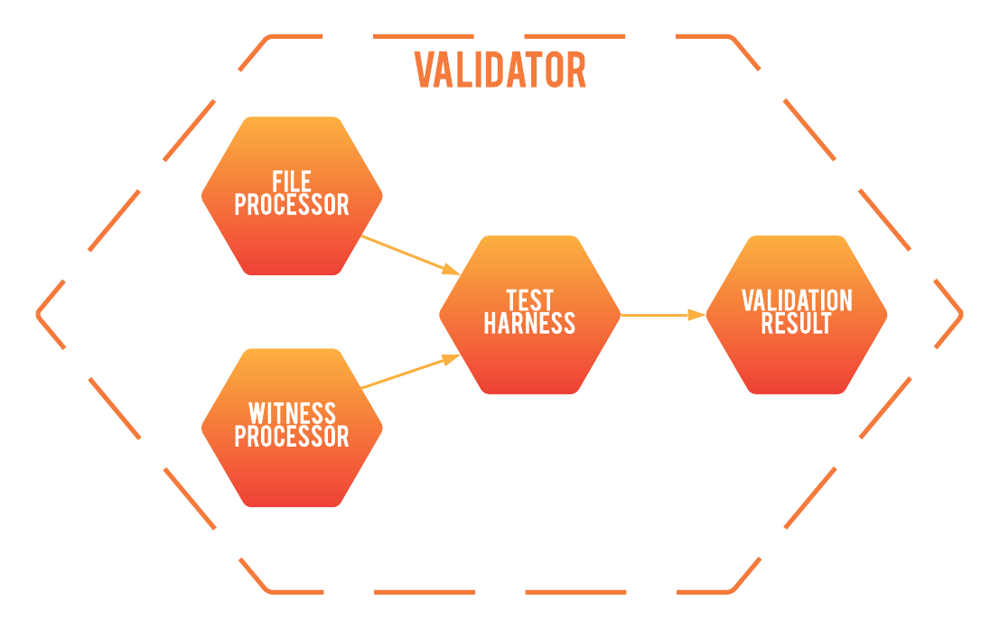

<div align="center">
  <br>
</div>

-----------------

[](https://www.codacy.com/gh/polywit/polywit/dashboard?utm_source=github.com&amp;utm_medium=referral&amp;utm_content=polywit/polywit&amp;utm_campaign=Badge_Grade)

### Description
Modern verification tools report a violation witness amidst verification if a bug is encountered. Polywit employs execution-based validation to check the validity of the counterexample. This process involves extracting information on the assumptions of the verifier from the standardized exchange format for violation witnesses and building a test harness to provide a concrete execution of the program. The tool then executes the test harness on the code under verification and can either confirm or reject the violation witness if the relevant assertion is reached.

Whilst most modern execution-based validators such as wit4java and CPA-wit2test focus on specific language, polywit aims to provide an extensible, feature rich framework to allow for easy language integration and validator quality.

### Framework
For a general language, the polywit implementation has the following architecture:
<div align="center">
  <br>
</div>

- The **File Processor** deals with processing of the compilation units.
- The **Witness Processor** deals with processing of the witness.
- The **Test Harness** deals with construction and execution of a test to check the validity of the reported violation.
### Literature

- [Wit4Java: A violation-witness validator for Java verifiers (competition contribution)](https://doi.org/10.1007/978-3-030-99527-0_36) by Wu, T., Schrammel, P., & Cordeiro, L. C. International Conference on Tools and Algorithms for the Construction and Analysis of Systems. Springer, Cham, 2022. Springer [doi.org/10.1007/978-3-030-99527-0_36](https://doi.org/10.1007/978-3-030-99527-0_36)
## Usage
```
usage: polywit [-h] frontend ...

Validate a given program with a witness conforming to the appropriate SV-COMP
exchange format.

positional arguments:
  frontend    Frontend language
    java      Use the java validator

options:
  -h, --help  show this help message and exit
```
### Authors
Joss Moffatt (University of Manchester, United Kingdom) josshmoffatt@gmail.com

Tong Wu (University of Manchester, United Kingdom) wutonguom@gmail.com

Lucas Cordeiro (University of Manchester, United Kingdom) lucas.cordeiro@manchester.ac.uk

Peter Schrammel (University of Sussex, United Kingdom) P.Schrammel@sussex.ac.uk
